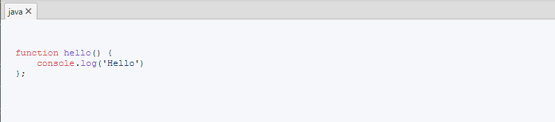

# Block code for JavaFx examples

### Code

```java
    // Imperative style
    BlockCode block = new BlockCode();
    block.setTheme(Theme.GITHUB);
    block.setCodeType(CodeType.JAVASCRIPT);
    block.setContent("""
                        function hello() { 
                            console.log('Hello') 
                        };""");
    block.build();

    // Declarative style
    BlockCode code = new BlockCode()
            .theme(Theme.GITHUB)
            .codeType(CodeType.JAVASCRIPT)
            .content("function hello() { console.log('Hello') };")
            .build();
```


### Screenshots
  