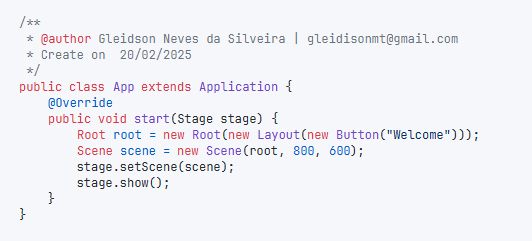
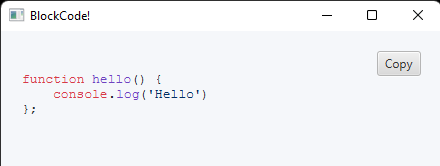
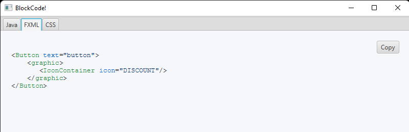

# Block code for JavaFx examples

This code uses an adaption from https://highlightjs.org/
<br>
Block code is a simple web view (javafx) that implements a highlight in its content.

📰 2 — Now block code uses JetBrains Font (it's a specific font created to code).
##### See it.

<br>
📰 1 — Refactoring code to use javafx 20+


🧬
```
| -- BlockCode          (StackPane) 
  | -- Code             (WebView)
  | -- Copy Action      (Button)
  
```
### 👾 Example

```java
    // Imperative style
    BlockCode block = new BlockCode();
    block.setTheme(Theme.GITHUB);
    block.setCodeType(CodeType.JAVASCRIPT);
    block.setContent("""
                        function hello() { 
                            console.log('Hello') 
                        };""");
    block.build();

    // Declarative style
    BlockCode code = new BlockCode()
            .theme(Theme.GITHUB)
            .codeType(CodeType.JAVASCRIPT)
            .content("function hello() { console.log('Hello') };")
            .build();
```
<p style="text-align: center">
    
</p>

```
|-- BlockCodeView (TabPane)
    |-- Tab (Tab) 'java'
        |-- BlockCode (StackPane)
            |-- Code   (WebView)
    |-- Tab (Tab) 'FXML'
        |-- BlockCode (StackPane)
            |-- Code   (WebView)
    |-- Tab (Tab) 'Css'
        |-- BlockCode (StackPane)
            |-- Code   (WebView)
    
```
### 👾 Example
```java
    // Or using tabs
    BlockCodeView block = new BlockCodeView();
    block.setJava("""
            Button button = new Button("Cancel");
            """);
    
    block.setFXML("""
            <Button text="button">
                <graphic>
                   <IconContainer icon="DISCOUNT"/>
                </graphic>
            </Button>
            """);
    
    block.setCss("""
            .button {
                -fx-accent: red;
            }
            """);
```
### 🎆 The Result
<p style="text-align: center">
  
</p>

### Setting copy event
```java
block.setOnCopying(e -> {
        ...
});
```

### Styling copy button
```css
.copy-button {
    ...
}
```
Or
```java
public class CustomBlockCode extends BlockCode {

    @Override
    protected Button createCopyButton() {
        return new Button("Copy 2");
    }
}
```

